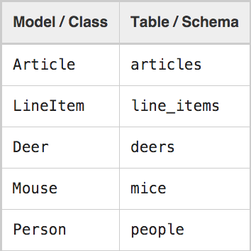

# Rails

### Active Record Basics

Active Record is the **M** in **MVC** - the model - which is the layer of the
system responsible for representing business **data** and **logic**. Active 
Record facilitates the creation and use of **business objects** whose data 
requires persistent storage to a database.

##### O que é ORM?

Object-relational mapping is a programming technique for converting data between
incompatible type systems in object-oriented programming languages. This 
creates, in effect, a "virtual object database" that can be used from within 
the programming language.

+ Represent models and their data.
+ Represent associations between these models.
+ Represent inheritance hierarchies through related models.
+ Validate models before they get persisted to the database.
+ Perform database operations in an object-oriented fashion.

##### Naming Conventions

For example, a class Book, you should have a database table called books. The 
Rails pluralization mechanisms are very powerful, being capable to pluralize 
(and singularize) both regular and irregular words. When using class names 
composed of two or more words, the model class name should follow the Ruby 
conventions, using the CamelCase form, while the table name must contain the 
words separated by underscores.

+ Database Table - Plural with underscores separating words (e.g., book_clubs).
+ Model Class - Singular with the first letter of each word capitalized 
(e.g., BookClub).



##### Schema Conventions

+ **Foreign keys** - These fields should be named following the pattern 
`singularized_table_name_id` (e.g., item_id, order_id). These are the fields 
that Active Record will look for when you create associations between your 
models.

+ **Primary keys** - By default, Active Record will use an integer column named 
id  as the table's primary key. When using Active Record Migrations to create 
your tables, this column will be automatically created.

+ created_at` - Automatically gets set to the current date and time when the 
record is first created.

+ updated_at` - Automatically gets set to the current date and time whenever 
the record is updated.

##### Creating Active Record Models

It is very easy to create Active Record models. All you have to do is to 
subclass the ActiveRecord::Base class and you're good to go:

```console
$ rails generate model Product
```

That command will create:

```console
invoke  active_record
      create    db/migrate/20160223194525_create_products.rb
      create    app/models/product.rb
      invoke    test_unit
      create      test/models/product_test.rb
      create      test/fixtures/products.yml
```

### Active Record Migrations
### Action Controller Overview
### Rails routing from the outside In
### Action View form helpers
### Layouts e Rendering Rails
### Rails command line tools e rake tasks	
### Active Records Validations
### Active Records Callbacks
### Active Records Assosiation
### Active Records Carry Interface
### Asset Pipeline
### Working with JavaScript in Rails

### Gemas Extras
	
##### Devise
##### Cancancan
##### PaperClip
##### ActiveAdmin
##### Rspec
##### Slim
##### Factory-Girl
##### Bootstrap
##### Sass
##### Capybara

### Reference

https://en.wikipedia.org/wiki/Object-relational_mapping
http://guides.rubyonrails.org/